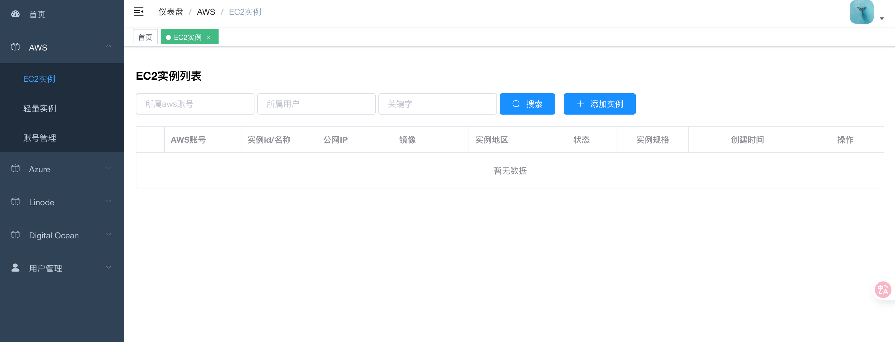
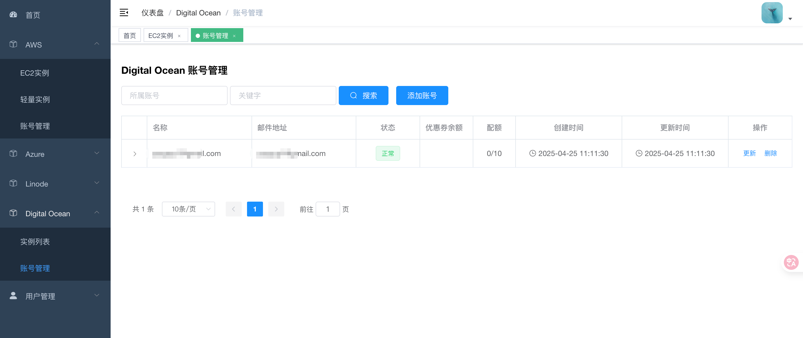

# CloudPanel

[](https://github.com/Nodewebzsz/cloudpanel/actions/workflows/docker-publish.yml)

CloudPanel 是一个强大的多云服务管理平台，支持管理和监控多个主流云服务提供商的资源。通过统一的界面，轻松管理 AWS、Azure、DigitalOcean 和 Linode 等云服务资源。

## 快速开始

### 一键安装（推荐）

使用自动安装脚本可完成 Docker 安装、环境配置和服务部署：

#### 自动安装到默认目录 (/opt/cloudpanel)
```bash
curl -fsSL https://raw.githubusercontent.com/Nodewebzsz/cloudpanel/refs/heads/main/install.sh | bash
```
#### 或下载后运行
```bash
wget -O /opt/cloudpanel https://raw.githubusercontent.com/Nodewebzsz/cloudpanel/refs/heads/main/install.sh | bash
chmod +x install.sh && ./install.sh
```

**自定义参数：**
```bash
./install.sh -d /opt/cloudpanel -f 8080 -b 9090
```
| 参数 | 说明 | 默认值 |
|------|------|--------|
| `-d` | 安装目录 | `/opt/cloudpanel` |
| `-f` | 前端端口 | `8086` |
| `-b` | 后端端口 | `8111` |

### 手动部署

使用 Docker Compose 本地构建部署：

#### 1. 部署项目文件夹：
```bash
mkdir cloudpanel
```

#### 2. 创建必要的目录：

```bash
cd cloudpanel && mkdir -p data/mysql data/redis logs

```


#### 3. 下载docker-compose部署文件
```bash
wget https://raw.githubusercontent.com/Nodewebzsz/cloudpanel/refs/heads/main/docker-compose.yml -O docker-compose.yml  

```


#### 4. 配置环境变量：

```bash
# 复制配置文件
wget https://raw.githubusercontent.com/Nodewebzsz/cloudpanel/refs/heads/main/.env.example -O .env   

# 编辑配置文件，设置必要参数（特别是 MYSQL_PASSWORD 和 DJANGO_SECRET_KEY）
vim .env
```

环境变量配置示例：
```bash
# 安全设置 - 请生成随机密钥
# 生成命令: python -c 'from django.core.management.utils import get_random_secret_key; print(get_random_secret_key())'
DJANGO_SECRET_KEY=your-secret-key-here

# 数据库密码
MYSQL_PASSWORD=your-strong-password

# 端口设置
FRONTENDPORT=8086
BACKENDPORT=8111
```

#### 5. 部署前准备工作
##### 安装Docker、Docker Compose
```bash
apt update -y && apt install -y curl && curl -fsSL https://get.docker.com | bash -s docker

curl -L "https://github.com/docker/compose/releases/latest/download/docker-compose-$(uname -s)-$(uname -m)" -o /usr/local/bin/docker-compose && chmod +x /usr/local/bin/docker-compose
```
#### 6. 运行部署命令
```bash
docker-compose up -d
```
#### 7. 查看默认用户名、密码

```bash
docker logs cloudpanel-api
```

### 其他可选操作，可以忽略
#### 1. 创建管理员账户：

```bash
docker exec -it cloudpanel-api /bin/bash
python manage.py createsuperuser --username admin --email admin@admin.com
```

#### 2. 初始化 AWS 镜像数据（可选）：

```bash
python manage.py aws_update_images
```
### GitHub Container Registry

镜像推送到 GitHub Container Registry (ghcr.io)，Docker 会自动检测架构并拉取对应镜像。

```bash
docker pull ghcr.io/nodewebzsz/cloudpanel:latest
```

## 功能特点

- 多云服务提供商支持（AWS、Azure、DigitalOcean、Linode）
- 统一的资源管理界面
- 用户权限管理系统
- 容器化部署支持
- 异步任务处理
- RESTful API 接口

## 系统要求

- Docker 19.03+ (支持多架构构建)
- Docker Compose

## 前端页面展示




## 访问前端平台

在浏览器中访问：`http://your-server-ip:8086`

### 管理数据库后台

管理员可以通过以下地址访问管理后台：`http://your-server-ip:8111/api/admin`

管理后台功能包括：
- 用户管理：创建、编辑、删除用户
- 权限管理：分配和管理用户权限
- 云服务管理：管理各云服务提供商的配置
- 系统设置：管理系统全局配置
- 日志查看：查看系统操作日志

> 注意：请确保使用管理员账户登录管理后台，普通用户无法访问此页面。

## 多架构部署注意事项

1. **自动架构检测**：
   Docker 会自动检测宿主机架构（AMD64 或 ARM64）并拉取对应镜像，无需手动配置 PLATFORM 环境变量。

2. **性能考虑**：
   - ARM64 架构下某些依赖包可能需要额外的编译时间
   - 适当设置容器资源限制

3. **数据迁移**：
   - 不同架构间的数据文件不能直接迁移
   - 需要通过导出/导入方式迁移数据

4. **健康检查**：
   所有服务都配置了健康检查，可以通过以下命令查看状态：
   ```bash
   docker-compose ps
   docker-compose logs
   ```

5. **资源限制配置**：
   ```yaml
   services:
     panel:
       deploy:
         resources:
           limits:
             cpus: '1.0'
             memory: 1G
           reservations:
             cpus: '0.5'
             memory: 512M
   ```

## 开发说明

### 项目结构

```
.
├── apps/           # 主应用目录
│   ├── aws/       # AWS 服务模块
│   ├── azure/     # Azure 服务模块
│   ├── do/        # DigitalOcean 模块
│   ├── linode/    # Linode 服务模块
│   └── users/     # 用户管理模块
├── libs/          # 公共库
├── config/        # 配置文件
├── logs/         # 日志目录
└── panelProject/ # 项目核心目录
```

### 技术栈

- 后端框架：Django 4.2
- 数据库：MySQL 9
- 缓存：Redis
- 任务队列：Celery
- WSGI 服务器：Gunicorn
- 容器化：Docker

## 环境变量配置

项目使用环境变量来管理敏感配置信息，主要包括：

- AWS 配置
  - AWS_ACCESS_KEY_ID：AWS 访问密钥 ID
  - AWS_SECRET_ACCESS_KEY：AWS 密钥
  - AWS_ACCOUNT_EMAIL：AWS 账户邮箱
  - AWS_ACCOUNT_NAME：AWS 账户名称

- 数据库配置
  - MYSQL_HOST：MySQL 主机地址
  - MYSQL_PORT：MySQL 端口
  - MYSQL_DATABASE：数据库名称
  - MYSQL_USER：数据库用户名
  - MYSQL_PASSWORD：数据库密码

- Redis 配置
  - REDIS_HOST：Redis 主机地址
  - REDIS_PORT：Redis 端口

- Django 配置
  - DJANGO_SETTINGS_MODULE：Django 设置模块
  - DJANGO_SECRET_KEY：Django 密钥（**必须设置为随机生成的强密钥**）
  - ALLOWED_HOSTS：允许的域名（逗号分隔）
  - CORS_ALLOWED_ORIGINS：CORS 白名单（逗号分隔）

## 注意事项

1. 当前版本为预览版本，功能持续更新中
2. 支持 x86_64 和 ARM64 架构的 Docker 部署（Docker 自动检测）
3. 如遇到问题，请在 Issues 中反馈
4. 请确保妥善保管环境变量文件，**不要将其提交到版本控制系统**
5. **生产环境部署前**，请务必：
   - 设置 `DEBUG=0`
   - 生成强 `DJANGO_SECRET_KEY`
   - 设置 `MYSQL_PASSWORD` 为强密码
   - 配置 `ALLOWED_HOSTS` 和 `CORS_ALLOWED_ORIGINS` 为实际域名

## 贡献指南

我们欢迎所有形式的贡献，包括但不限于：

- 提交问题和建议
- 改进文档
- 提交代码改进
- 分享使用经验

请确保在提交 Pull Request 之前：

1. Fork 本仓库
2. 创建您的特性分支 (`git checkout -b feature/AmazingFeature`)
3. 提交您的更改 (`git commit -m 'Add some AmazingFeature'`)
4. 推送到分支 (`git push origin feature/AmazingFeature`)
5. 打开一个 Pull Request

## 许可证

本项目采用 MIT 许可证。详见 [LICENSE](LICENSE) 文件。

## 联系方式

- 项目维护者：@Nodewebzsz
- 项目主页：[https://github.com/Nodewebzsz/cloudpanel]
- 问题反馈：请使用 GitHub Issues

## 致谢

本项目基于 [cdntip/cloudpanel](https://github.com/cdntip/cloudpanel) 二次整合发布，感谢原作者的贡献和开源精神。我们在此向原作者致以诚挚的感谢！

## Star History

[](https://www.star-history.com/#Nodewebzsz/cloudpanel&Date)


## Stargazers over time
[](https://starchart.cc/Nodewebzsz/cloudpanel)
